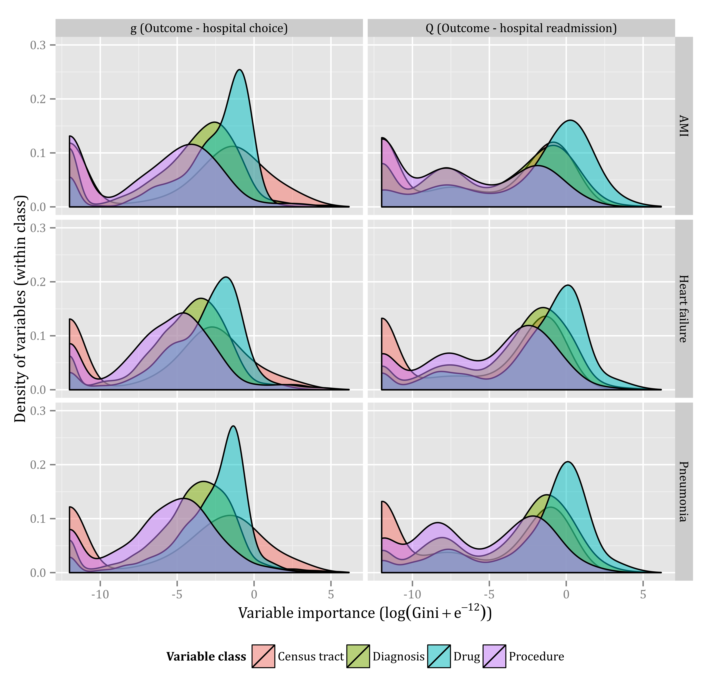

Readmissions and TMLE
=====================

I am currently developing this code in preparation for a manuscript. Indeed, the manuscript itself is included in the paper directory.

Guide for reproducibility
-------------------------

Eventually, I will provide a guide on how to reproduce this paper, but I can't include the data.

For now, you can take a look inside a fairly complicated Makefile to understand how everything goes together. The code for the "main" statistical analysis are contained within build_rf_Q_star_model.R.

A pretty picture
----------------
And here is one of the figures that I am particularly fond of:

